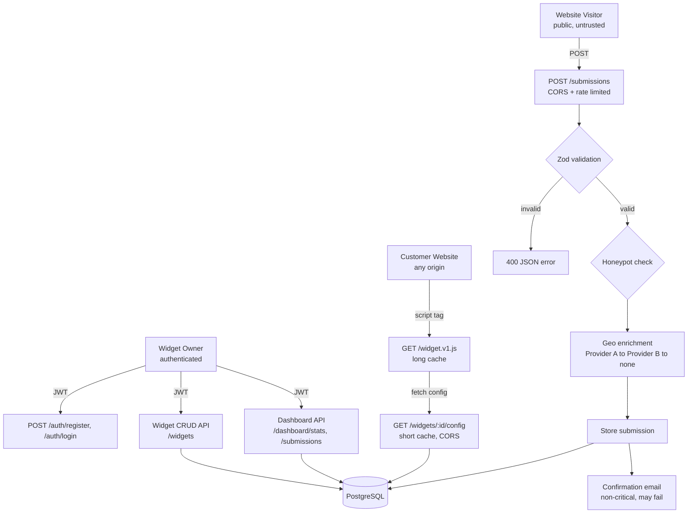

# FlyRank Capstone — Embeddable Widget & Lead-Capture Platform

A backend platform that lets a business create an embeddable lead-capture widget,
install it on any website with a single `<script>` tag, and safely receive
submissions from the public internet — validated, spam-filtered, geo-enriched,
rate-limited, and viewable on a dashboard.

## Overview

Three separate actors use this system:

1. **Widget owner** (authenticated tenant) — registers, logs in, creates widgets,
   views a dashboard of submissions and stats.
2. **Customer website** (any origin) — embeds one `<script>` tag, which fetches
   the widget's config and renders a form.
3. **Website visitor** (public, untrusted) — submits the form. The request is
   validated, checked for spam, rate-limited, geo-enriched (with a fallback
   chain), stored, and triggers a non-critical confirmation "email" (console-logged).

## Architecture

Three request paths, kept deliberately separate:

    Widget Owner (JWT auth)
      -> /auth/register, /auth/login
      -> /widgets (CRUD, tenant-isolated)
      -> /dashboard/stats, /dashboard/submissions

    Customer Website (any origin, CORS-enabled)
      -> GET /widget.v1.js?id=123   (versioned bundle, long cache)
      -> GET /widgets/:id/config    (widget config, short cache)

    Website Visitor (public, CORS-enabled, rate-limited)
      -> POST /submissions
           -> Zod validation (bad payload -> 400, never 500)
           -> honeypot spam check
           -> geo enrichment: provider A -> (fails) -> provider B -> (fails) -> store anyway
           -> store submission
           -> confirmation "email" (console log) - failure never blocks the response

Layered code structure:

    routes -> controllers -> services -> repositories
                    |
               middleware (auth, rate limiting)

- **routes**: map URLs to controller functions
- **controllers**: parse the HTTP request, call the service, shape the HTTP response
- **services**: business logic (auth, geo fallback chain, submission pipeline)
- **repositories**: the only layer allowed to write raw SQL
- **middleware**: JWT verification, rate limiting, CORS

This separation means swapping Postgres for another database only touches the
repositories layer — nothing else changes.

## Tech Stack

- Node.js + Express (ES Modules)
- PostgreSQL 16 (Docker)
- Zod (validation)
- bcrypt (password hashing) + jsonwebtoken (JWT auth)
- express-rate-limit (abuse protection)
- Node's built-in test runner + Supertest (automated tests)
- Free geo providers: ip-api.com (primary), ipapi.co (fallback) - no API key required

## Setup & Run Instructions

Requires: Node.js 18+, Docker Desktop, Git.

    git clone https://github.com/Fatimshaikh/flyrank-capstone-widget-platform.git
    cd flyrank-capstone-widget-platform
    npm install
    cp .env.example .env
    docker compose up -d
    npm run migrate
    npm run dev

Server runs at http://localhost:3000. Health check: `GET /health`.

To see the widget render on a second origin (proving cross-origin embedding works):

    python -m http.server 5500 --directory public-test-site

Then open http://localhost:5500 in a browser.

To run the automated test suite:

    npm test

## API Documentation

### Auth (public)
- `POST /auth/register` — `{ email, password }` -> `201 { user, token }`
- `POST /auth/login` — `{ email, password }` -> `200 { user, token }`

### Widgets (requires `Authorization: Bearer <token>`)
- `POST /widgets` — create a widget -> `201`, includes `embed_snippet`
- `GET /widgets` — list this tenant's widgets
- `GET /widgets/:id` — get one widget (404 if it belongs to another tenant)
- `PATCH /widgets/:id` — update a widget
- `DELETE /widgets/:id` — delete a widget

### Public widget delivery (no auth, CORS-enabled)
- `GET /widget.v1.js?id=<id>` — the embeddable JS bundle
- `GET /widgets/:id/config` — widget configuration JSON

### Submissions (no auth, CORS-enabled, rate-limited: 10/min per IP)
- `POST /submissions` — `{ widget_id, data, website? }` -> `201 { success, id, spam }`
  - `website` is a honeypot field: real users never fill it, bots often do

### Dashboard (requires `Authorization: Bearer <token>`)
- `GET /dashboard/stats` — total submissions, by-widget, by-country, last-7-days
- `GET /dashboard/submissions?widget_id=<optional>` — full submission list

## Testing

14 automated tests covering: registration, duplicate email rejection, input
validation, login success/failure, widget CRUD, tenant isolation, CORS preflight
handling, malformed/oversized payload rejection, and honeypot detection.

Run with `npm test`. See `EVIDENCE.md` for manual proof of every Definition-of-Done
item, including rate limiting bursts and email failure-tolerance.

## Limitations (honest, by design)

- **No real email delivery.** Confirmation "emails" are logged to the console.
  What's graded and tested is that a failing email provider never blocks a
  successful submission — not actual deliverability. See `BUILDLOG.md`.
- **No widget visual styling/customization.** The widget renders as a minimal
  functional form. This is a backend capstone; the grade lives in the API design,
  not the CSS.
- **No hosting/CDN/domain.** Runs entirely on localhost via Docker, per the
  capstone's $0-tools constraint. The "customer site" is a plain HTML file
  served from a second local port to prove cross-origin behavior.
- Geo enrichment returns null country/city for localhost/private IPs
  (127.0.0.1, ::1, 192.168.x.x) since public geo APIs can't resolve them -
  this is expected in local testing, not a bug.

See `DESIGN.md` for the original data model and API surface plan, and
`BUILDLOG.md` for a full troubleshooting log of every issue hit while building this.

## Architecture Diagram

